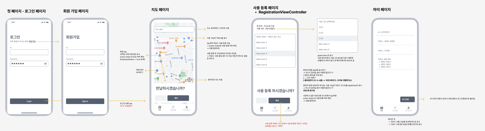

### Figma Screenshot

&nbsp;&nbsp;&nbsp;&nbsp;  

#

### Structure

<pre>  
kickboards-ios/
│
│
├── ViewControllers/
│   ├── LoginViewController.swift
│   ├── SignInViewController.swift
│   ├── MapViewController.swift
│   ├── MyPageViewController.swift
│   └── RegistraionViewController.swift
│
├── Views/
│   ├── MyPageTableViewCell.swift
│   └── KickboardTableViewCell.swift
│
└── Utilities/
│    └── Utility.swift
│
└── Models/
    └── Model.swift
    
</pre>
